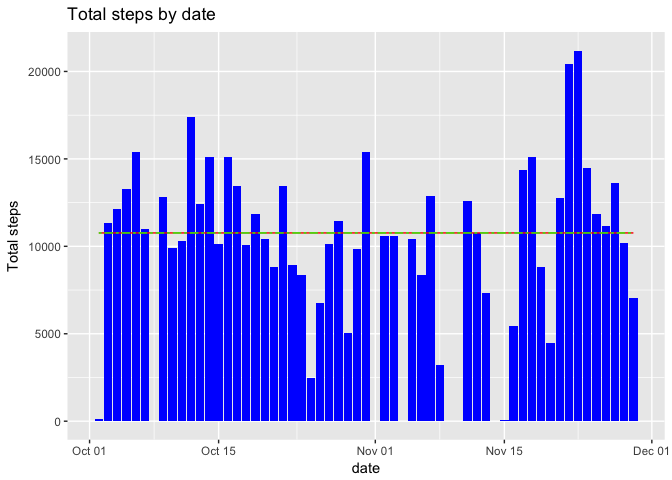
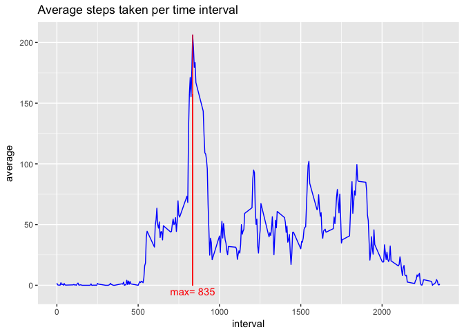
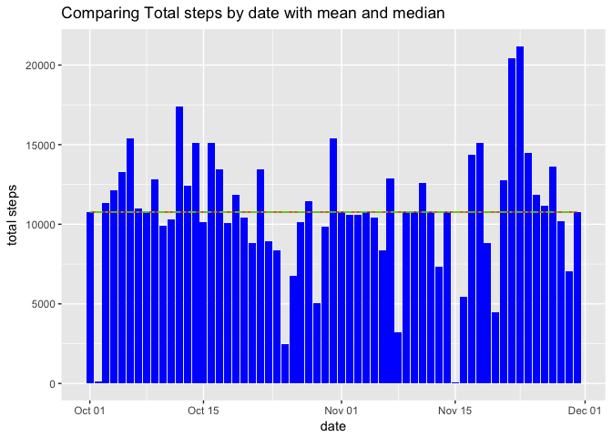
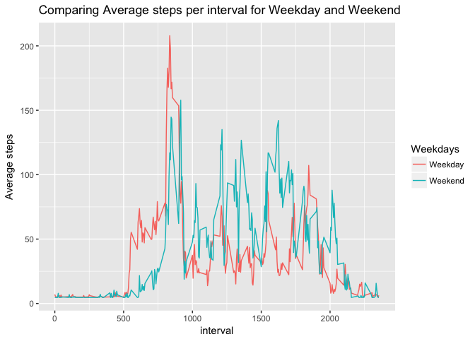

We will start by download the dataactivity file and load it into the df_data data frame:


```r
if (!file.exists('dataactivity.zip')) {
    download.file('https://d396qusza40orc.cloudfront.net/repdata%2Fdata%2Factivity.zip',
                  destfile = 'dataactivity.zip')
}
if (!file.exists('activity.csv')) {
    unzip('dataactivity.zip')
}

df_data <- read.csv('activity.csv',sep=',',header=TRUE) 
df_data$date <- as.Date(df_data$date)
```

I then calculate the mean total number of steps taken per day

```r
library(dplyr)
```

```
## 
## Attaching package: 'dplyr'
```

```
## The following objects are masked from 'package:stats':
## 
##     filter, lag
```

```
## The following objects are masked from 'package:base':
## 
##     intersect, setdiff, setequal, union
```

```r
library(ggplot2)

# Group the data by date and calculate the mean for each date (grouped by)
df_mean <- df_data[complete.cases(df_data),] # Delete rows that contains NAs


#Calculate the steps mean by date
df_mean <- group_by(df_mean, date)
df_mean <- summarise(df_mean,mean=mean(steps),median=median(steps),total=sum(steps))

#Print the total number of steps taken per day:
cols <- c("LINE1"="#f04546","LINE2"="#3591d1","BAR"="#62c76b")

ggplot(data=df_mean,aes(date,total)) + geom_histogram(stat='identity',fill='blue') + 
    geom_line(aes(y=mean(df_mean$total)),color='red') +
    geom_line(aes(y=median(df_mean$total)),color='green',linetype=6) +
    ggtitle('Total steps by date') +
    labs(y='Total steps')
```

```
## Warning: Ignoring unknown parameters: binwidth, bins, pad
```

<!-- -->

```r
#geom_hline(yintercept = mean(df_mean$total),color='LINE1') + 
#geom_hline(yintercept = median(df_mean$total),linetype=6, aes(color='LINE2')) 
```

Then I will calculate the daily activity pattern by making a time series plot of the 5-minute interval (x-axis) and the average number of steps taken, averaged across all days (y-axis)

```r
df_ts <- df_data[complete.cases(df_data),]
df_ts <- group_by(df_ts,interval)
df_ts <- summarise(df_ts,average=mean(steps))

ggplot(data=df_ts,aes(x=interval,y=average)) + geom_line(color='blue') +
    geom_line(aes(x=df_ts$interval[which(df_ts$average == max(df_ts$average))]),color='red') +
    annotate("text",x=df_ts$interval[which(df_ts$average == max(df_ts$average))],y=-5, 
             label=paste('max=',df_ts$interval[which(df_ts$average == max(df_ts$average))]),color='red')+
    ggtitle('Average steps taken per time interval')
```

<!-- -->

Next step we will identify missing value and impement a strategy to fill those missing values

```r
df_filled <- df_data # Initiate a new Data Frame with df_data

#Calculate the total number of missing values sin the Data set
int_na <- sum(is.na(df_filled$steps))
paste('Number of NAs:',int_na)
```

```
## [1] "Number of NAs: 2304"
```

```r
#Calculate the mean value for steps
int_meanSteps <- mean(df_filled$steps,na.rm = TRUE)

#Fill nas with the mean value
df_filled$steps[is.na(df_filled$steps)] <- int_meanSteps


#Group the DF by date 
df_summary <- group_by(df_filled,date)
df_summary <- summarise(df_summary, total=sum(steps))

ggplot(df_summary, aes(x=date,y=total)) + geom_histogram(stat='identity', fill='blue') +
    geom_line(aes(y=mean(df_summary$total)),color='red') + geom_line(aes(y=median(df_summary$total)),color='green',linetype=6) +
    ggtitle('Comparing Total steps by date with mean and median') +
    labs(y='total steps')
```

```
## Warning: Ignoring unknown parameters: binwidth, bins, pad
```

<!-- -->
When comparing the 2 histograms I don't see major impact of the NAs value on the overall study.
Now we are going to check if there are difference in activity patterns between weekdays and weekend.

```r
#Function used for sapply it will allow to convert weekdays into 2 variables factor
fun_formatweeks <- function(x) {
    if(x %in% c('Monday','Tuesday','Wednesday','Thursday','Friday')) {
        return('Weekday')
    } else {
        return('Weekend')
    }
}
#End of Function

df_filled <- mutate(df_filled,weekday=weekdays(df_filled$date))
df_filled <- mutate(df_filled,weekday2=unname(sapply(df_filled$weekday,fun_formatweeks)))

df_filled$weekday2 <- as.factor(df_filled$weekday2) #Convert the column into factor

#Create  a panel plot containing a time series plot of the 5-minute interval (x-axis) and the average number of steps taken, averaged across all weekday days or weekend days (y-axis). 

df_summary <- group_by(df_filled,weekday2,interval)
df_summary <- summarise(df_summary,average=mean(steps))

ggplot(df_summary, aes(x=interval,y=average, color=weekday2)) + geom_line() + 
ggtitle('Comparing Average steps per interval for Weekday and Weekend') + 
    labs(y='Average steps', colour='Weekdays')
```

<!-- -->


